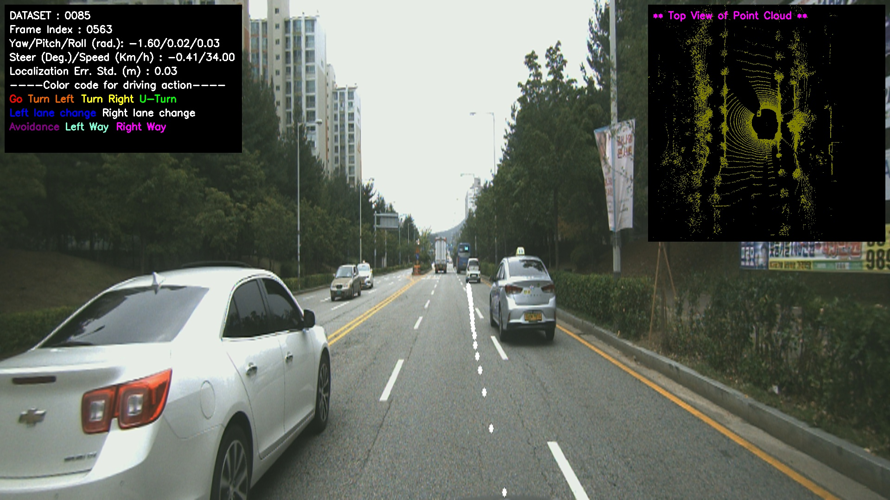
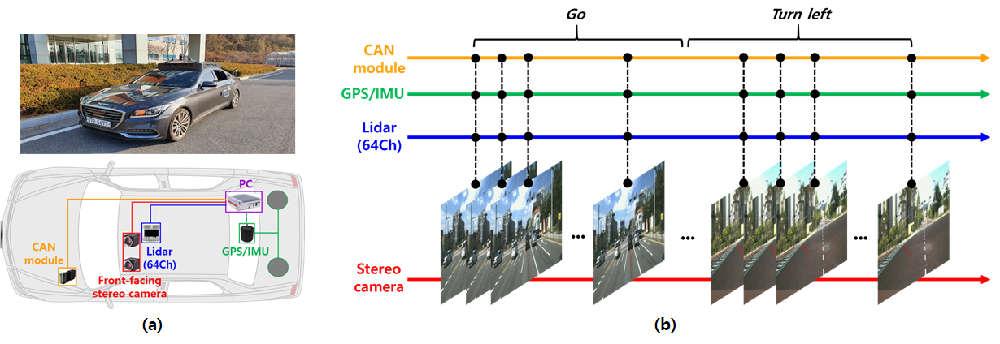
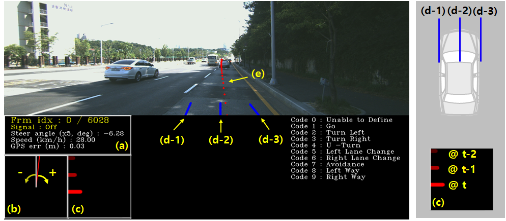
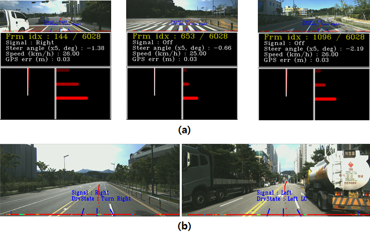
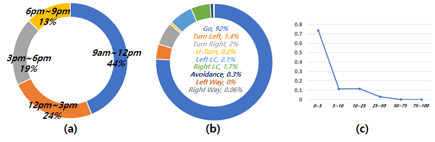
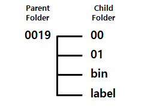
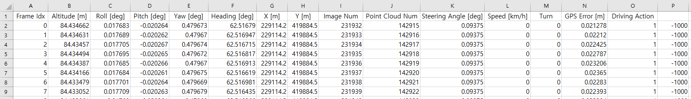
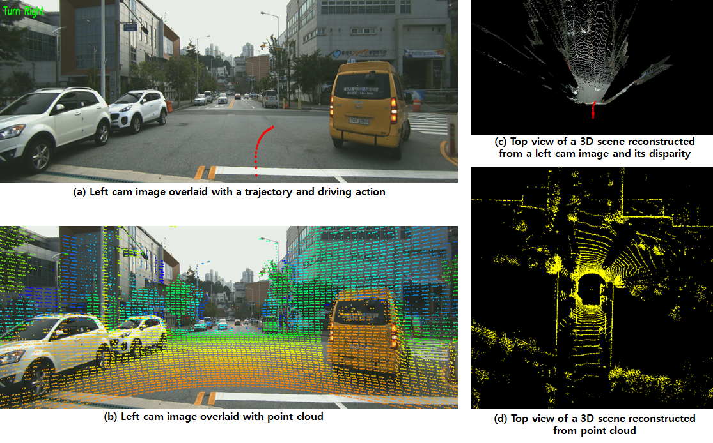

# ETRIDriving

[](https://youtu.be/cYyecNvo1Pg)
[**Click the image above for video play!!**]

## Notice
+ [21-01-24] We open some sequences to the public. Links for the download can be found at the end of this webpage. We will release the rest of the sequences as soon as possible.
+ [21-02-19] We found that we missed some license plates and faces during the blurring process. We are now trying to fix it. If you find yourself or personal belongings in this dataset and feel unwell about it, please contact (d1024.choi@etri.re.kr) and we will immediately remove the respective data.
+ [21-05-10] We decided to upload the sequences used in the paper (see below) first and the rest after that.


## Introduction
**ETRIDriving** is the autonomous driving dataset labeled with discrete high-level driving actions of the ego-vehicle. To assemble **ETRIDriving**, we collected raw data from sensors mounted on the vehicle (two front-facing cameras, a Lidar scanner (OUSTER, OS1-64), GPS/IMU (Spatial FOG Dual), and CAN) at 10Hz while driving. The raw data was processed to be in data formats readable at common PC operating systems. After synchronizing the processed data, we assigned one of the nine actions (**Go, Turn Left/Right, U-Turn, Left/Right Lane Change, Avoidance, Left/Right Way**) to every frame in the data manually. There are 129 sequences of length 10 minutes in **ETRIDriving** and the sequences were collected by three drivers in Daejeon City during 9AM~9PM, on sunny and cloudy day, from August 2019 to December 2019.





## Annotation (To-be-updated)
Three annotators, who had driven the vehicle, assigned one of the nine actions to each frame of the dataset. The annotators used the tool, which we developed based on PyQt, for the labeling process. The figure below shows a screen shot of the tool.



The tool visualizes all the information about the current state of the vehicle as seen in the figure. 

    (a) frame index, turn signal, steering angle, vehicle speed, GPS accuracy
    (b) visualization of steering angle 
    (c) visualization of rate of change in steering angle (at current, previous, and previous previous frame index)
    (d) guidelines corresponding to the left side, center line, and right side of the vehicle
    (e) future trajectory up to 2 sec

The annotators were instructed to find the start and end frame indices of the actions based upon the information and their memories of driving. We also made the labeling guidelines on how to find the start and end frame indices of an action. The following is the brief description of our guideline on 'Turn'. (If you want to know details, contact d1024.choi@etri.re.kr.)



Rule1) start frame index of a turn action is found by observing turn signal, steering angle, rate of change in steering angle, future trajectory, and blue guidelines. Around the start frame index, it is usually found that (see the upper-row of the figure)

    (1) turn signal turns on
    (2) rate of change in steering angle shows an increasing or decreasing pattern in time
    (3) center line of the vehicle begins to deviate from the center of the lane

Rule2) end frame index of a turn action corresponds to the index where the three blue guidelines are all inside the target lane (see the bottom-row of the figure)


## Characteristics
We show in the figure below the distributions of the dataset with respect to time, driving actions, and localization accuracy. Note that (c) shows the normalized histogram of the standard deviation of the localization error (centimeter).




## Dataset Folder Structure
The sequences are named with 4-digits numbers (from 0000 to 0131). The raw data corresponding to a sequence is stored in a folder named after the sequence number. The figure below shows the folder structure for **0019**.



In **00** and **01**, there are front-facing left and right camera image files, respectively. The images were preprocessed to remove lens distortions before they were saved in PNG format of size 1280x360x3. The files are named with 8-digits numbers.

In **bin**, there are bin files storing point clouds from LIDAR scanner. The files are named with 8-digits numbers.

In **label**, there are two csv files, one for extrinsic calibration parameters (0019_cam0_extcalib.csv) and the other for synchronization, GPS/IMU info, CAN info, and labels (0019_drvsts.csv). The figure below shows the elements of 0019_drvsts.csv.




## Development Kit
We share some codes written in python for loading and visualizing the data in **ETRIDriving**. You can run an example code by
```sh
$ python example.py
```

We show some visualization examples in the figure below.



## Download (To-be-updated)
For sharing the sequences in the dataset, we have been applying some image processing (blurring face and license plate) to the front-view images in the sequences. 

------------------ Sequences used in the paper ------------------

+ Seq 0000 https://drive.google.com/file/d/1CLGkooc-_EDUqf4tV_HrRy7xe5aoWt0_/view?usp=sharing
+ Seq 0004 https://drive.google.com/file/d/1w_-BxARRArAasanxUk0wWtBtohQlb4k_/view?usp=sharing
+ Seq 0009 https://drive.google.com/file/d/1xrd8sUs9qJwnhFxmQz6bWUHMDq1AXfia/view?usp=sharing 
+ Seq 0013 https://drive.google.com/file/d/12QZ63bPBi2GRhD28iObMDjdNCDUBfFuL/view?usp=sharing
+ Seq 0016 https://drive.google.com/file/d/1-7LAJ987ic2IPWjAHLftI4M7OGxdiaIR/view?usp=sharing
+ Seq 0018 https://drive.google.com/file/d/1Vc4b0zeBQ63MCgRBjPTsFSuqY2E86dJm/view?usp=sharing
+ Seq 0019 https://drive.google.com/file/d/1vhc2E7OrAKoh6Yb9J6cPTTclG-RahQJu/view?usp=sharing 
+ Seq 0021 https://drive.google.com/file/d/1zDhUYtJg0GKy2ZIyq5ERB9fRx_Gfn2K0/view?usp=sharing
+ Seq 0023 https://drive.google.com/file/d/1xMZXuf8sn4oEPaDQPk-sePcVeNGknG6s/view?usp=sharing
+ Seq 0024 https://drive.google.com/file/d/1z-g_OZ3jnd_Qs5q6kLmGHC60jRwsqScC/view?usp=sharing
+ Seq 0027 https://drive.google.com/file/d/1bWl8Nf9HNd6JVRlm4LYLHhQh01ht8Kl8/view?usp=sharing 
+ Seq 0028 https://drive.google.com/file/d/1L5Euj_-uMJ087LNxIIlIFGt0tH--dTdp/view?usp=sharing
+ Seq 0030 https://drive.google.com/file/d/1q5Omd0dLXyGhc_QWBt0mUObVFOhYXnB0/view?usp=sharing
+ Seq 0032 https://drive.google.com/file/d/1nRSbFSAKliclq4V0Ij1xRm-F2ChGvnGO/view?usp=sharing
+ Seq 0033 https://drive.google.com/file/d/11YsAfRR2ZeVqtwxk5SjWfDoQal-7OClQ/view?usp=sharing 
+ Seq 0034 https://drive.google.com/file/d/1PVu6bHdZjRP1jHiMob7jKVjIImaPWKeN/view?usp=sharing
+ Seq 0036 https://drive.google.com/file/d/1MiSmZKzYHUL0ubSXNQzqLqq9FgTiQErz/view?usp=sharing
+ Seq 0039 https://drive.google.com/file/d/1HMze2bU_LEM8KY0klAnMX_SfSsdNbXly/view?usp=sharing
+ Seq 0046 https://drive.google.com/file/d/1C0_YTqbxWt1PQUpd8fRWO_araglcMFQI/view?usp=sharing
+ Seq 0047 https://drive.google.com/file/d/1GmyIkCUoR6g-i_fj38ifbUr4KP44M-v1/view?usp=sharing 
+ Seq 0048 https://drive.google.com/file/d/1f1e2DSTJD2h8oCOHMm4UraRKRiL8a13Q/view?usp=sharing
+ Seq 0053 https://drive.google.com/file/d/1LN6kU2S1fUqe8OC9xnKGdxdpJZzkA4K4/view?usp=sharing
+ Seq 0058 https://drive.google.com/file/d/12AUjSAVTfz2oz599i3BOM-BR3Awkggqb/view?usp=sharing
+ Seq 0061 https://drive.google.com/file/d/1lPBhTVheEr02AtBSFerFouw-f4_8Puxm/view?usp=sharing
+ Seq 0064 https://drive.google.com/file/d/1bMLOH7hUzc9YjHjZQ7dy3TpYGTD8-htg/view?usp=sharing
+ Seq 0067 https://drive.google.com/file/d/1zo7sfanQJvtEzsMBv7beAfQlB57AhYUm/view?usp=sharing
+ Seq 0071 https://drive.google.com/file/d/1vyGnN0_0aa0P3f1XGRa9kPIqbQqsmUp5/view?usp=sharing 
+ Seq 0075 https://drive.google.com/file/d/1OyDsxFb8Ai4MbaW2DMbkpm7eJy95mov1/view?usp=sharing
+ Seq 0084 https://drive.google.com/file/d/1BnAAuVLEFS7I-Lz3Kndz0y9Wq1bOO_3u/view?usp=sharing
+ Seq 0098 https://drive.google.com/file/d/1nGcC2Kig8usbWaZCEViAxRXgSk5Q1OJZ/view?usp=sharing
+ Seq 0103 https://drive.google.com/file/d/1I3I0SebfM5QjQE4oMZlfCHcmJcax_j67/view?usp=sharing

------------------ The rests ------------------

+ Seq 0001 https://drive.google.com/file/d/1uLW0imiV9X8xQfu0m0r5bBJo0y1PDvlA/view?usp=sharing
+ Seq 0002 https://drive.google.com/file/d/1IFHePUyI3oLZ6yX49hzN2Wzr3gRf05jf/view?usp=sharing
+ Seq 0003 https://drive.google.com/file/d/1b1mhiGFlOgAm549VKaMrCD3pUu0oab6h/view?usp=sharing
+ Seq 0005 https://drive.google.com/file/d/1KoIzmp2jQiYJHAlfZyfQy3cAN_0A8pLX/view?usp=sharing
+ Seq 0006 https://drive.google.com/file/d/1I5lLLAigOv49tgBy3cYa4KP2QYHJrX7m/view?usp=sharing
+ Seq 0007 https://drive.google.com/file/d/1VEjC6QHCv0gabPaCbGVmEWfiu_-OChSf/view?usp=sharing
+ Seq 0008 https://drive.google.com/file/d/1RLHYpVGQOy6dlmQkEZiBzigUZlIq-Dr4/view?usp=sharing
+ Seq 0010 https://drive.google.com/file/d/1SINA4VwXhwKmqNogTMj5W3dm6yvtKsaK/view?usp=sharing
+ Seq 0011 https://drive.google.com/file/d/1dFax9H0rB4eduQpzRE9ziPw-ISdAWuQa/view?usp=sharing
+ Seq 0012 https://drive.google.com/file/d/1rC5HbMUYEzAVNEDloSn-ccQiqtNcP0w2/view?usp=sharing
+ Seq 0014 https://drive.google.com/file/d/1DAOkYFfHYilriEPdvYCSxN89AJbambiL/view?usp=sharing
+ Seq 0015 https://drive.google.com/file/d/1HNgA9KidpU2jhSdEQEBtZZadaGN-dxKx/view?usp=sharing

## Citation
```
@article{Choi,
author = {D. Choi and S.-J. Han and K. Min and J. Choi},
title = {PathGAN: Local Path Planning with Attentive Generative Adversarial Networks},
journal = {arXiv:2007.03877},
year = 2021
}
```

## Copyright
ETRIDriving is made available for academic use only. ETRIDriving is copyrighted by us and published under the Creative Commons Attribution-NonCommercial-ShareAlike 3.0 License. This means that you may not use this dataset for commercial purposes and if you alter, transform, or build upon this work, you may distribute the resulting work only under the same license.
